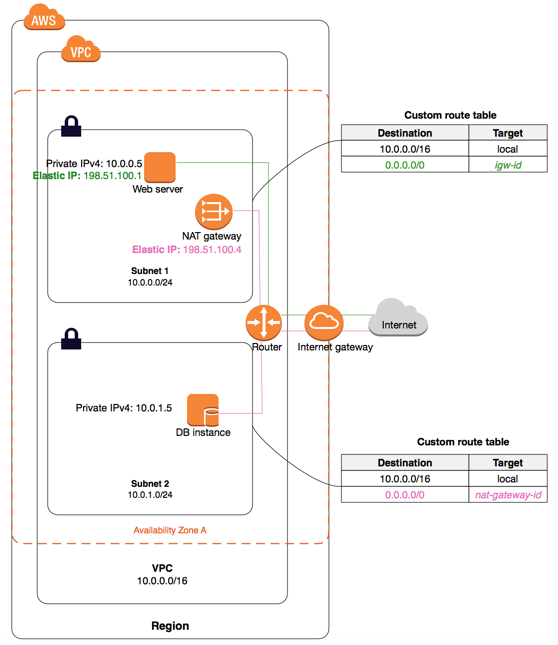

# terraform-aws-vpc


This repository contains the terraform scripts to setup a AWS VPC with public and private subnets.

This repository would take care of the following tasks:
* Create a VPC with the specified CIDR.
* Create both public and private subnets in the specified AZ(s) with the designed CIDR.
* Create internet gateway and NAT gateway
* Create S3 VPC endpoint so we could access S3 directly within VPC.

## How to use
```
$ terraform init
$ terraform workspace usea1
$ terraform plan  -var-file configs/usea1.tfvars
$ terraform apply -var-file configs/usea1.tfvars
```